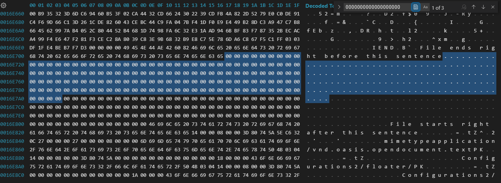
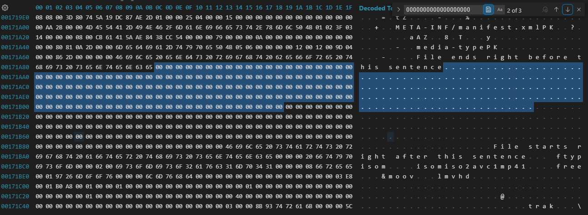
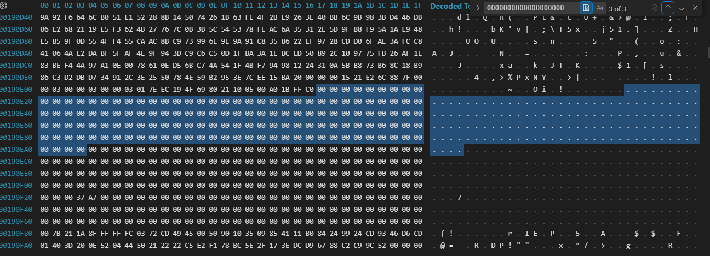
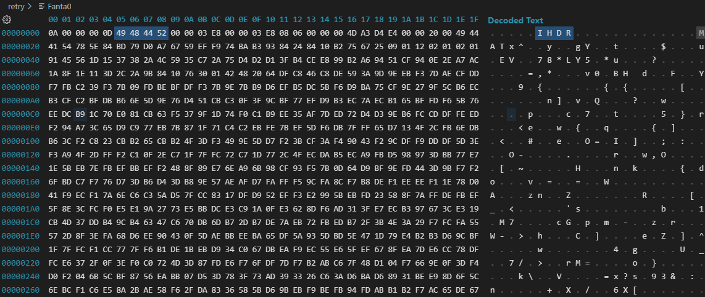
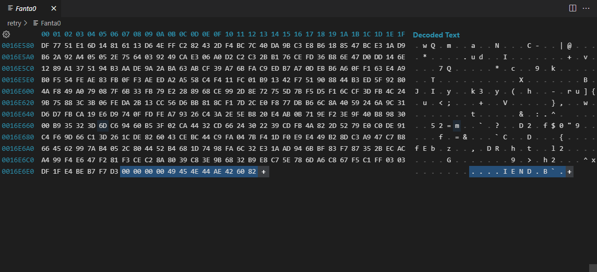
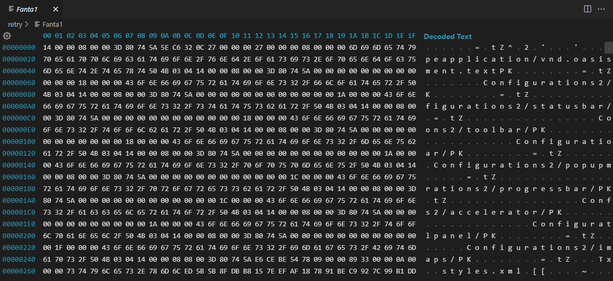
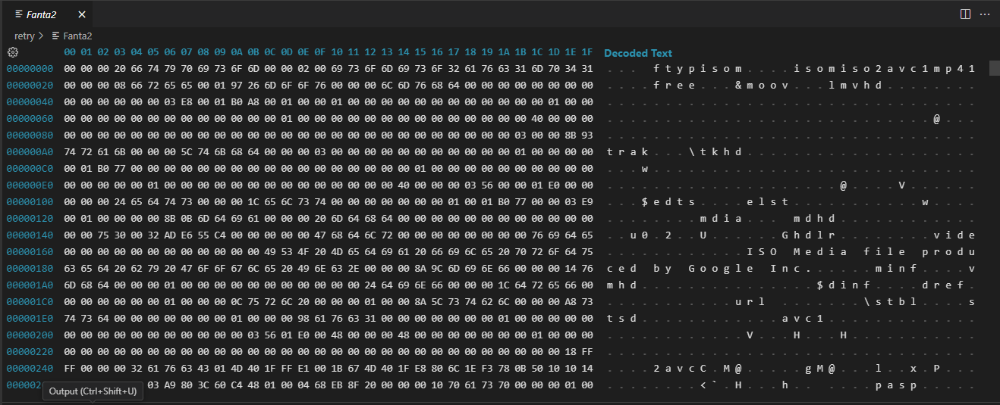
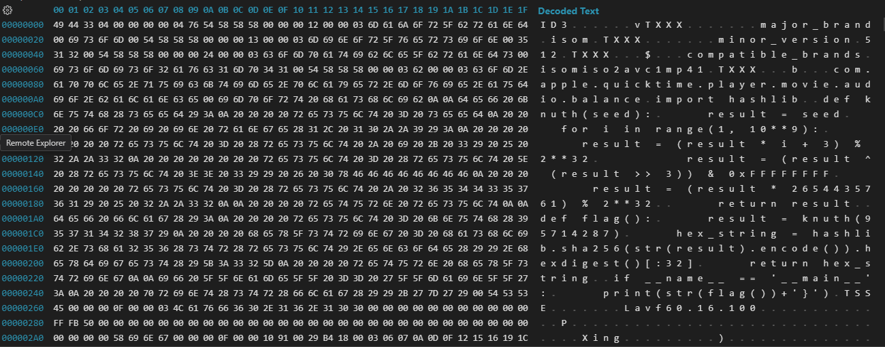

# Digital Instrumentality Project - Writeup

## Files related to solving the challenge are in their respective folders

The Beginning -> step1\
Repair service -> step2\
Decryption in progress -> step3

## Please open issue should you have any questions. It will be added to the respective Q&A section.

Author: S051_Destroy Lai Lai's Machine (aka DLLM)


## Situation

Digital Instrumentality Project

Episode 26 of Evangelion... but for computers! Files are losing their 'ego' and turning into LCL of 1s and 0s. All hope is not yet lost because the files are still separated by 'buffers' of 00s. Restore 'ego' of 3 files and 'carve' them out.

Author: Karma\
Flag Format: PUCTF25{[a-zA-Z0-9_]+_[a-fA-F0-9]{32}}\

<details>
<summary>Hint:</summary>
1. My favorite color is green 2. Open the document for some hints
</details>

Attachments:\
`Fanta_file_new`\
(Stored at `step1/Fanta_file_new`)

## The Beginning

The first thing we see is a file called `Fanta_file_new`.\
We know that it contains at least 3 files, because the challenge asked us to "Restore 'ego' of **3** files and 'carve' them out."

### Identifying the Files

first, let's view its content in hex editor (I use hex editor in vscode).



After searching for a large pad of 00s, we found 3 matches, 2 of them is interesting.\
They got "File ends right before this sentence" and "File starts right after this sentence" right next to the pads,\
which is quite obvious that we have 3 files in this big thingy.

### Extracting the Files

By using a simple python program (cause python is fast to write):

```python
with open("Fanta_file_new", "rb") as f:
  cont = f.read()

padded = cont.split(b"File starts right after this sentence")
not_padded = []
for n in padded:
  not_padded.append(n.split(b"File ends right before this sentence")[0])

for n in range(3):
  with open("Fanta"+str(n), "wb") as f:
    f.write(not_padded[n])
```

we can extract the 3 files' content as Fanta0, Fanta1 and Fanta2

## The Beginning - checkpoint Q&A

**Q - Why not use the NUL padding as the split?**\
A - Because I found out the amount of NUL pads are not consistent, and copying and pasting a text is easier than typing a bunch of `\00`

**Q - Why Fanta{n}?**\
A - Because I dont want to waste time onto naming, the init file is a Fanta_file so I just Fanta it all the way

## Repair service

whenever I encounter file with unknown type, I always do a `binwalk` first

```console
admin@XXXX:/mnt/c/Users/XXXX/DIP/step2$ binwalk *

Scan Time:     2025-04-20 21:20:03
Target File:   /mnt/c/Users/XXXX/DIP/step2/Fanta0
MD5 Checksum:  5511009f2ecd4d075beb4be27cafc969
Signatures:    411

DECIMAL       HEXADECIMAL     DESCRIPTION
--------------------------------------------------------------------------------


Scan Time:     2025-04-20 21:20:03
Target File:   /mnt/c/Users/XXXX/DIP/step2/Fanta1
MD5 Checksum:  af3b27fa39169f96675c610ebd59e75e
Signatures:    411

DECIMAL       HEXADECIMAL     DESCRIPTION
--------------------------------------------------------------------------------
73            0x49            Zip archive data, at least v2.0 to extract, name: Configurations2/floater/
127           0x7F            Zip archive data, at least v2.0 to extract, name: Configurations2/statusbar/
183           0xB7            Zip archive data, at least v2.0 to extract, name: Configurations2/toolbar/
237           0xED            Zip archive data, at least v2.0 to extract, name: Configurations2/menubar/
291           0x123           Zip archive data, at least v2.0 to extract, name: Configurations2/popupmenu/
347           0x15B           Zip archive data, at least v2.0 to extract, name: Configurations2/progressbar/
405           0x195           Zip archive data, at least v2.0 to extract, name: Configurations2/accelerator/
463           0x1CF           Zip archive data, at least v2.0 to extract, name: Configurations2/toolpanel/
519           0x207           Zip archive data, at least v2.0 to extract, name: Configurations2/images/Bitmaps/
580           0x244           Zip archive data, at least v2.0 to extract, compressed size: 2424, uncompressed size: 13193, name: styles.xml
3044          0xBE4           Zip archive data, at least v2.0 to extract, compressed size: 261, uncompressed size: 899, name: manifest.rdf
3347          0xD13           Zip archive data, at least v2.0 to extract, compressed size: 1087, uncompressed size: 4780, name: content.xml
4475          0x117B          Zip archive data, at least v2.0 to extract, compressed size: 451, uncompressed size: 976, name: meta.xml
4964          0x1364          Zip archive data, at least v2.0 to extract, compressed size: 2034, uncompressed size: 14534, name: settings.xml
7040          0x1B80          Zip archive data, at least v2.0 to extract, compressed size: 4080, uncompressed size: 4080, name: Thumbnails/thumbnail.png
11174         0x2BA6          Zip archive data, at least v2.0 to extract, compressed size: 301, uncompressed size: 1061, name: META-INF/manifest.xml
11526         0x2D06          Zip archive data, at least v2.0 to extract, compressed size: 84, uncompressed size: 121, name: media-type
12831         0x321F          End of Zip archive, footer length: 22


Scan Time:     2025-04-20 21:20:03
Target File:   /mnt/c/Users/XXXX/DIP/step2/Fanta2
MD5 Checksum:  aac32d6f73d92be923d7190092f320d9
Signatures:    411

DECIMAL       HEXADECIMAL     DESCRIPTION
--------------------------------------------------------------------------------

```

well, it seems that Fanta1 is a zip file, we can rename it to `Fanta1.zip` first\
how about the rest?

### Fanta0



opening it in hex editor, we can see IHDR. What is that?

searching IHDR online, we can see the first few results are related to PNG.\
(btw IHDR is a chunk that contains the image information such as width, height, size of color byte, color type, compression, filter and enlacement method)

we can double check that by going to the end of the file, where lies `0000000049454e44ae426082`, a classic PNG file suffix


but Fanta0.png seemed to have its header missing

by going to [libpng.org](http://www.libpng.org/pub/png/spec/1.2/PNG-Structure.html), we can see the head of a PNG is 89 50 4E 47 0D 0A 1A 0A {4 bytes} 49 48 44 52

what is 49 48 44 52? `IHDR`! we know where it is!\
now we know what bytes are missing, and we can repair it.

don't forget to add a .png extension to Fanta0

### Fanta1

things are much easier when you already know what it is



hmm, where is the `PK\x03\x04` signature of the zip? Lets add it in, it's now fixed

### Fanta2

let's hex it too



is there anything familiar?
`avc1mp4` from 0x18 to 0x1E

which means it is a mp4 with avc1 encodings

lets add the .mp4 extension to it first...\
wait it's already fixed? wow

## Repair service - checkpoint Q&A

**Q - how do you know the only thing missing in Fanta1.zip is `PK\x03\x04`?**\
A - you can see more `PK\x03\x04\x14\x00\x00\x08\x00\x00\x3D\80` chunks below.\
By cross referencing (always has been) you can see the only missing is `PK\x03\x04` (the header)\
where the mininum version needed to extract (`\x14\x00`), \
general purpose bit flag (`\x00\x00`), \
compression method (`\x08\x00`), \
etc are all intact

## Decryption in progress

now we have repaired all the Fantas, lets hunt!

### Fanta0.png

whenever steganography gets into images, exiftool, steghide and zsteg are tools that get instantly tried out first

look what do we have here in zsteg

```console
b1,r,lsb,xy .. text: "]{\"hasText\":true,\"hasFile\":false,\"encrypted\":\"\",\"dataLength\":37,\"channels\":[\"G\"],\"bitDepth\":1}"
b1,r,msb,xy .. text: "&D\\DD4D&"
b1,g,lsb,xy .. text: "!PUCTF25{1st_Rule_of_fite_club_is_"
b1,rgba,lsb,xy .. file: RDI Acoustic Doppler Current Profiler (ADCP)
b3,bgr,lsb,xy .. text: ")'m%mIR`"
b4,r,lsb,xy .. text: "$0\"4@5T|!1I"
b4,g,lsb,xy .. text: "%13%Q5El 0H"
b4,b,lsb,xy .. text: "%13%Q5El 0H"
b4,rgb,lsb,xy .. text: "#232$UEP"
b4,bgr,lsb,xy .. text: "3#2\"5TUA"
b4,rgba,lsb,xy .. text: "#?#?2/E_E_"
```

now we have the first part of the flag
`PUCTF25{1st_Rule_of_fite_club_is_`

### Fanta1.zip

unzip it first before anything

structure:

```tree
Fanta1
│   content.xml
│   manifest.rdf
│   media-type
│   meta.xml
│   mimetype
│   settings.xml
│   styles.xml
│
├───Configurations2
│   ├───accelerator
│   ├───floater
│   ├───images
│   │   └───Bitmaps
│   ├───menubar
│   ├───popupmenu
│   ├───progressbar
│   ├───statusbar
│   ├───toolbar
│   └───toolpanel
├───META-INF
│       manifest.xml
│
└───Thumbnails
        thumbnail.png
```

we can see Configuration2 folder contains nothing, ignore

we can not see anything interesting in manifest.xml, manifest.rdf, meta.xml, mimetype, settings.xml, and styles.xml

we do see some hints in content.xml

```xml
...
<office:text>
...
<text:p text:style-name="P1">2 truths 1 lie</text:p>
<text:p text:style-name="P1"/>
<text:p text:style-name="P1"/>
<text:p text:style-name="P2">The encrypted flag is in here somewhere</text:p>
<text:p text:style-name="P2"/>
<text:p text:style-name="P2">
It’s
<text:span text:style-name="T1">only</text:span>
encrypted with base64
<text:span text:style-name="T2">and definitely not XOR</text:span>
</text:p>
<text:p text:style-name="P2"/>
<text:p text:style-name="P3">It hurts when I pee</text:p>
</office:text>
...
```

we dont even need to spend time assembling the structure, as we can see the rendered version (low quality) in thumbnail.png


<details open>
  <summary>A bit off topic</summary>

    --- START OFF TOPIC ---

    2 truth 1 lie
    only encrypted with base 64
    not XOR encrypted
    it hurts when Karma pees

    if only encrypted with base64 is a lie
    then it can be encrypted with other methods, not only XOR, 2nd might be true
    Karma could hurt when bro pee

    if not XOR encrypted is a lie
    then its encrypted by not just base64, first one is also a lie
    so its not possible

    if karma doesnt hurt when bro pee, then
    it is only encrypted with base64
    and it is not encryped by XOR

    later you will know this entire game is a lie btw

    ---END OFF TOPIC---
</details>

now the actual content btw

magic is inside media-type

```base64
09f09W09Z09W09Z09009x09/09T09H09t09W09f09j09l09709e09309B09W09a09G09d09t09V09m09F09o09f09009x09W09b09309x09n09Z09109Y09=
```

*(or if you want to skip step, you can see the last edit dates of the files in the decompressed structure, one file stands out, which is media-type. That's why I checked it first and skipped the hints about where it is. I'm not sure if this is intended)*

back to the magic

one thing very obvious is the 09

Well you might figured it out, yes 09 is a delimiter in this sequence.

after removing all the delimiter 09s, you get

```base64
fWZWZ0x/THtWfjl7e3BWaGdtVmFof0xWb3xnZ1Y=
```

the moment you see the equal sign (and maybe the hint too)\
you probably recalls a pretty popular cipher method, base64

after b64decode into ascii, you get

```none
}fVgLL{V~9{{pVhgmVahLVo|ggV
```

that doesn't seem to be a flag at all! what should we do?\
well recall the hints, let's try XOR

(btw here is when you know Karma's 2T1L is a lie, its either 3L or a 2L1T)

however, XOR cipher requires a key, what can it be?\
well do you recall the delimiter we ditched? lets try 09 as a key

we now get

```
to_nEvEr_w0rry_and_havE_funn_
```

which is the 2nd part of the flag

### Fanta2.mp4

There arn't some well-known steganography for mp4, as to what I know\
so lets begin by wandering around in its hex

...\
...\
...\
oops, over 9 million characters? hell naw

let's proceed by disassembling the mp4 back to frames and audio to lessen the workload\
(is there a better way? check out Q&A)[^3]

it doesn't seem to have anything sketchy in the frames, how about the audio?



WOAH I see some familiar wordings inside...\
is that a python script?

let's rip it out

here is the program

```python
import hashlib

def knuth(seed):
    result = seed
    for i in range(1, 10**9):
        result = (result * i + 3) % 2**32
        result = (result ^ (result >> 3)) & 0xFFFFFFFF
        result = (result * 2654435761) % 2**32

    return result

def flag():
    result = knuth(95714287)
    hex_string = hashlib.sha256(str(result).encode()).hexdigest()[:32]
    return hex_string

if __name__ == '__main__':
    print(str(flag())+'}')

```

we are looping bitwise and modulo operations for a billion times, for a slow language like python this would take forever

so why not rewrite it in a faster language, like c?

I'm not good at C, and the sha256 only runs once, so we don't need to rewrite the flag part, just the knuth

here's the converted script

```c
uint32_t knuth(uint32_t seed) {
    uint32_t result = seed;
    for (uint32_t i = 1; i < 1000000000; i++) {
        result = (result * i + 3) % 4294967296; // 2**32
        result = (result ^ (result >> 3)) & 0xFFFFFFFF;
        result = (result * 2654435761) % 4294967296; // 2**32
    }
    return result;
}
```

and I also did some tiny optimizations

```c
uint32_t knuth(uint32_t seed) {
    uint32_t result = seed;
    uint32_t factor = 2654435761;
    for (uint32_t i = 1; i < 1000000000; i++) {
        result = (result * i + 3);
        result ^= result >> 3;
        result *= factor;
    }
    return result;
}
```

after running `knuth(95714287)`, we can put the value inside sha256 and get the first 32 bytes
which is `3601bc5bcef53e15254046faf34ef764}`

finally, after merging them together, we get the full flag

```none
PUCTF25{1st_Rule_of_fite_club_is_to_nEvEr_w0rry_and_havE_funn_3601bc5bcef53e15254046faf34ef764}
```

## Decryption in progress - checkpoint Q&A

**Q - Why does Fanta1.zip contains so much xml and thumbnail and META-INF?**\
A - Only after I almost finish the entire challenge when I realise this is a `.odt` file instead of `.zip` (verified by checking mimetype)\
but since deflating it gives more informations imo, let's keep it as a zip

**Q - how did you even optimize knuth shuffle**\
A - this is going to be long.\
first, `% 2**32` and `& 0xFFFFFFFF` are the same thing, which is to restrict the result to 32 bits\
so, we can just remove them, and use a `int32` to store the result.\
Moreover, since there are no negative numbers in the code, the result is always positive, so we can use `uint32_t` to prevent overflows

after removing the modulo and bitwise and, \
you get `result = (result ^ (result >> 3));` and `result = (result * 2654435761);`,\
which can be replaced with `result ^= result >> 3;` and `result *= factor;`\
where `factor` is a constant `2654435761`

**Q[^3] - Arn't the code stored in exif data of the mp4?**\
A - Yes, but I only used window's explorer.exe to check exif of the mp4.\
The code IS stored in the EXIF of Fanta2.mp4, in the `balance` sector
